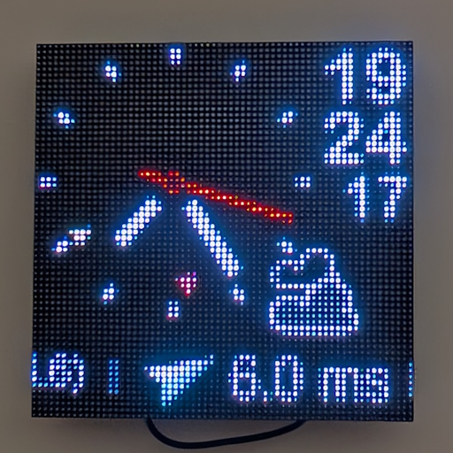
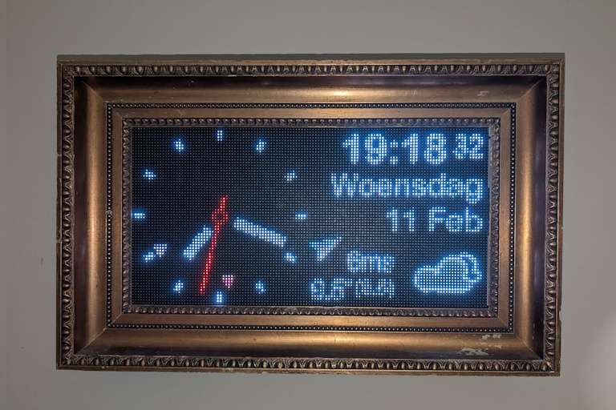
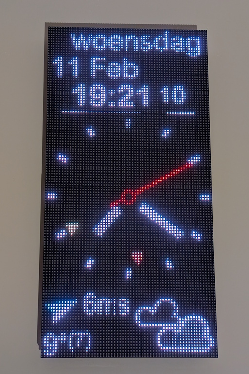
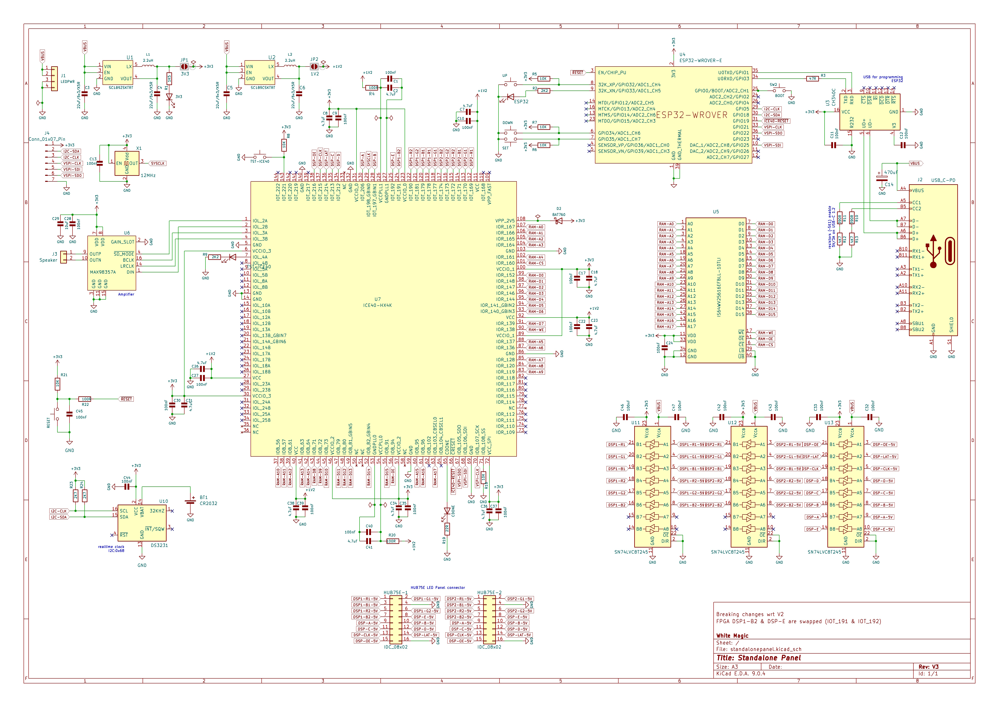
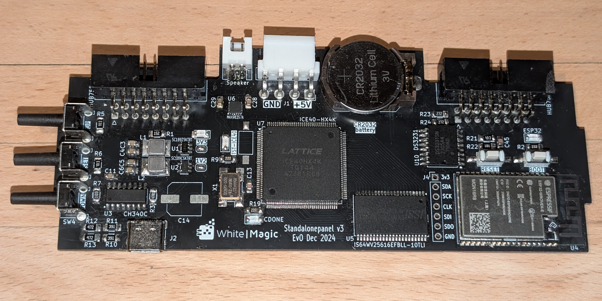
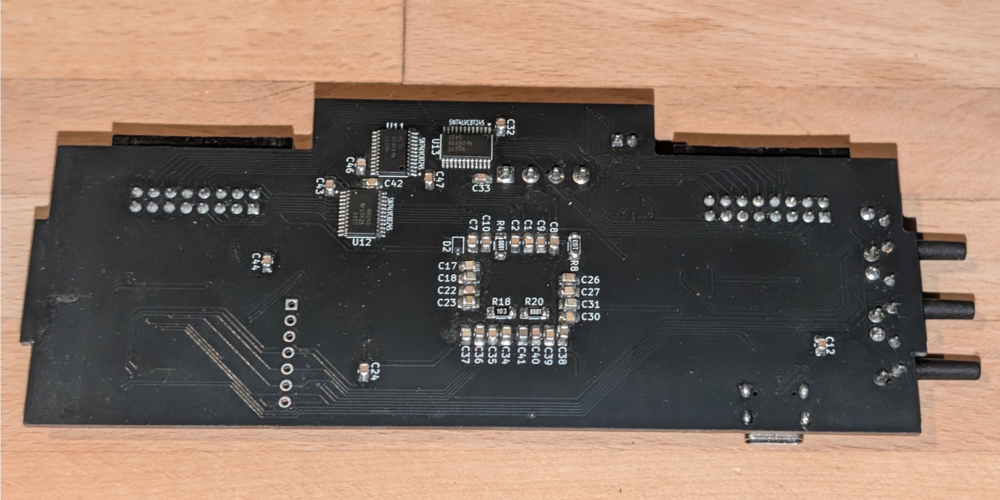

# 1 Introduction

This project was the result of wanting to do something with those 64x64 RGB panels you see so often. 
The HUB75 interface that they use requires constant updating at a speed of (max) 30MHz.
I saw very clever solutions using Arduino and ESP boards but they lacked the ability to refresh
at a high enough frequency or at 8 bit color depth. I have always wanted to do something with an FPGA
and this is my first projects integrating the ICE40HX4K FPGA chip into a design.

Since I like clocks (as so many people) in all their shapes I decided create a clock from it.

> _This repository contains all files for the hardware (Kicad), FPGA (VHDL via IceCUBE2), software (C++/FreeRTOS/PlatformIO) and the mechanical stl files (design was made from Fusion360 but these are not in this archive).  
However much more documentation is needed not only for others, but also for myself as a reference later on._

It clock comes in 2 flavors, as a double panel in 128x64 landscape or portrait mode and as a single 64x64 panel.

# 1.1 History

The initial idea began somewhere 2019 with the purchase of a MAX1000 FPGA board. For this I created a small breakout board to 2 HUB75 connectors. The FPGA was used to do 25Hz rendering at 8bit color depth. The USB connector on the [MAX1000 board](https://duckduckgo.com/?t=ffab&q=google+max1000+trenz&ia=web) was used to push screen updates from the Linux system to the FPGA. The software was C# that I developed and tested on Windows in a simulation and run on Linux afterwards. This setup worked ok but required an external PC (NUC) running linux. You can still find this code in the `old` directory.

I wanted a compact stand-alone setup so in 2024 I started on designing a standalone system. Since at that time the bare MAX10 chip was not easily for sale for searching for an alternative I ran into the ICE40 FPGA. Less capable but more than enough for my purpose. Only real drawback was that internal FPGA memory was far less resulting in the need to add some external static RAM. 

Software wise there was a lot of trial-and-erroring and a lot of hurdles to get over. At the end it all worked nicely but it lacked unittests and the code is quite messy at places. Specifically getting the graphics rendering up to speed was challenging. Running bare metal, the very simple task of drawing 
antialised graphics took months to complete. The solution here was to have the ability to draw an antialised triangle and use that as basis for the rest. Text drawing was done using the brilliant [libschrift](https://github.com/tomolt/libschrift) library that allows me to render TTF fonts.

So in the end, now I know what I want and need I should rewrite much of the software and structurally add unittest...

# 2 Hardware

The hardware used in this project is relatively simple, with an ESP32 as main controller running the clock software and continuously pushing newly rendered images to the FPGA.
An ICE40 FPGA is used to refresh the images on 2 HUB75 connected displays.
Other than these 2 main components, the is a static 256KB RAM chip where the FPGA stores the received images (24KB each) for displaying, a simple USB based powersupply for 3v3 and 1v8, the well known CH340 chip for programming and downloading. There is also a MAX983657 amplifier on there but software wise it is not used yet. Most parts of this schematic are from standard application notes.

 The assembled 2-layer PCB looks like this; 

# 3 Software

The software for the FPGA is VHDL compiled with the free (for personal use) [ICECube2 software](https://www.latticesemi.com/iCEcube2) from Lattice. 

The software for the ESP32 is developed using VisualCode and PlatformIO using FreeRTOS. The FPGA is configured via the ESP32 at startup via SPI. The ESP32 is setup to use A/B bootmode. When the software runs it will periodically (daily, weekly, monthly) check a configurable website if new software is available. If new software is found, it is installed and run. A special button combo during boot will revert the system back it fails.

The application uses 2 bitmaps that I toggle between. While 1 bitmap is being rendered, the other is sent to the FPGA. Since the ESP32 has 2 cores I typially use 1 core for rendering and the other for transferring the data. Some additional tasks run periodically like syncing with NTP and retrieving weather info.

The system has 3 buttons, `up`,`down` and `select` that are used for configuring the system. There are a number of configurable items for Wifi, NTP server, timezone etc. For weather information, [openweather](https://openweathermap.org/api) is used which requires you to request a free API key. This key also needs to be entered here together with your location. GUI-wise there is not much to configure the display is fixed but does display a variety of periodic animations, 5-minutes tick animations, expanding circles, game of life. 

A [usermanual](doc/usermanual.md) is found here.